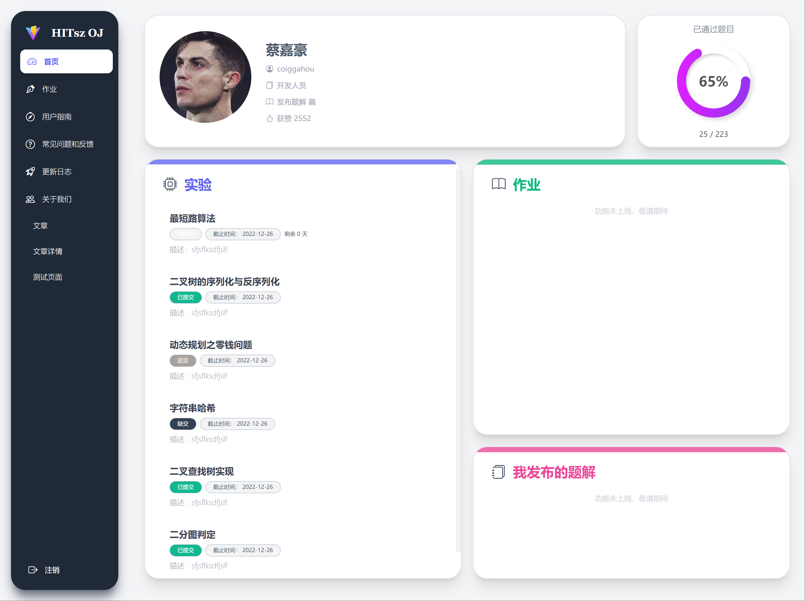

# HITsz OJ 实验平台重构版

> 贡献者：原 OJ 平台前端开发主力 [@Coiggahou2002](https://github.com/Coiggahou2002)

本项目计划对 HITsz 原有 OJ 实验平台进行以下方面的重构：

- 原有业务逻辑不变，按原样迁移
- 使用 Vue 3 + Vite 重写
- 重写 + 优化原有样式
- 整理 + 重构原有的代码

注：
- 本重构项目预计由笔者一人用爱发电，希望能坚持下去orz
- 欢迎想要参与贡献的小伙伴联系 coiggahou@foxmail.com

## 目前进度预览

> 注: 因为原项目代码结构冗杂，所以进度和 commits 暂时不保持同步，后续整体架构梳理完成之后会将 commits 与进度图对齐

---

以下为具体计划:

## 🎉 样式重写

### 基础组件样式

- [ ] 导航栏重写 (50%)
- [x] 自定义滚动条
- [ ] 自定义按钮组件
- [x] Message消息组件样式重写
- [ ] 首页改用 Grid 面板布局

### 学生端样式

- [ ] 页面布局重写

待补充...

### 教师端样式

- [ ] 页面布局重写
- [ ] 交互体验优化

待补充...

## ✨ 动画与特效

- [ ] 调研动画库
- [ ] 增加一些基本的交互动效

## 🛠️ 项目结构/工程化

- [x] 整合 mock.js
- [x] 将包管理器从 npm 换为 pnpm，减少后续维护者的包版本管理困难性
- [x] 使用 Sass + WindiCSS 工具简化样式代码，提高可读性与可维护性
- [ ] 样式部分完成后，业务逻辑代码用 TypeScript 重写

## ⚡ 性能优化

- [ ] 将只读格式的 Markdown 文本解析改到后端完成
- [ ] 减少组件库引入以减小包体积
- [ ] 上线阶段会逐步使用异步 + CDN 手段优化页面加载速度
